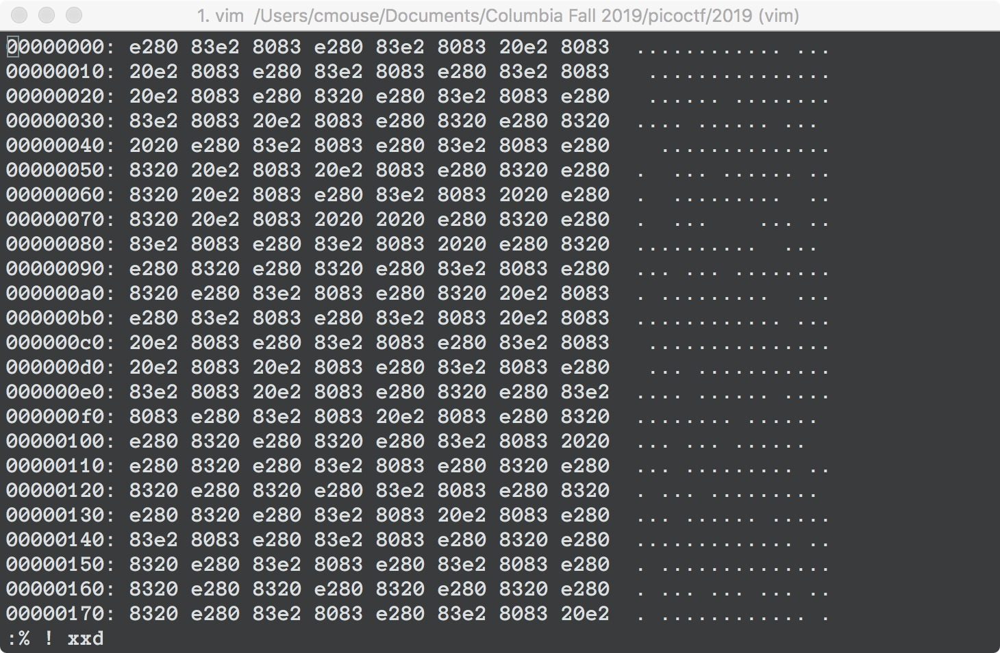

# WhitePages [Forensics] (250 pts)

I stopped using YellowPages and moved onto WhitePages... but [the page they gave me](https://2019shell1.picoctf.com/static/e134178261c6fa36e9058d5408118dd9/whitepages.txt) is all blank!

------

`whitepages.txt` opened in a hex editor looks like this:

As we can see, it consists of the SPACE character (20) and the EM SPACE character (e28083). Moreover, there seems to be a pattern: 4 EM SPACEs, 1 SPACE, 1 EM SPACE, 1 SPACE, 5 EM SPACEs, 1 SPACE...

If we map each of the EM SPACEs to a `0` bit, and each of the SPACEs to a `1` bit, we get a bitstring. Decoding that bitstring with ASCII gives us the flag.

The Python script for this part can be found at `whitepages_solver.py`.