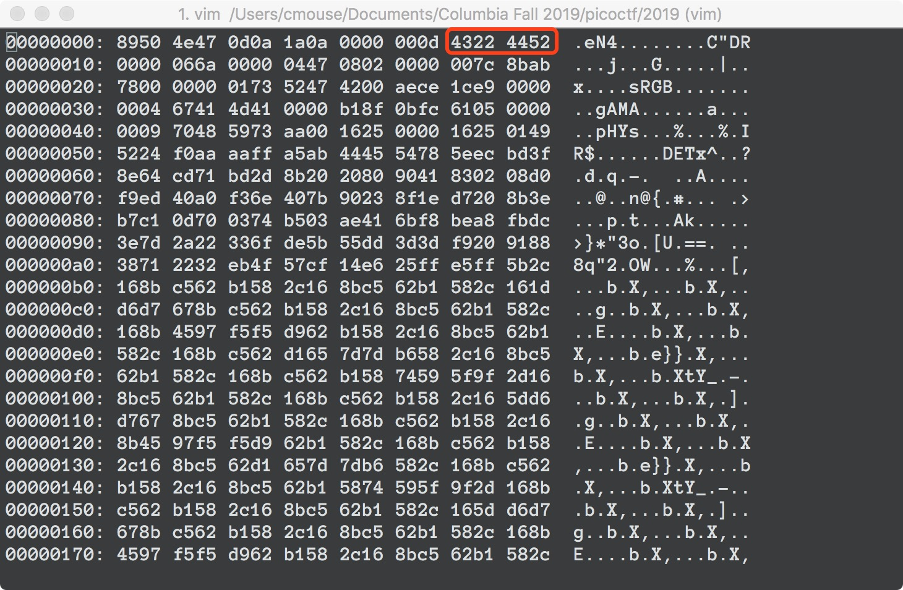

# c0rrupt [Forensics] (250 pts)

We found this [file](https://2019shell1.picoctf.com/static/3435d990f1d20fe3563cbb897b4c96db/mystery). Recover the flag. You can also find the file in /problems/c0rrupt_0_1fcad1344c25a122a00721e4af86de13.

------

Running `binwalk` on `mystery` gives us:

```
DECIMAL       HEXADECIMAL     DESCRIPTION
--------------------------------------------------------------------------------
91            0x5B            Zlib compressed data, compressed
```

There is Zlib compressed data at offset 91, which gives us suspicion that the file might be a PNG. Opening the file in a hex editor shows the trailer bytes `49 45 4E 44 AE 42 60 82`, which confirms our suspicion.


So lets try to fix the file header according to the PNG format.

The first 8 bytes should be `89 50 4E 47 0D 0A 1A 0A`.


The next 25 bytes is the IHDR chunk. The length part should be `00 00 00 0d`. The chunk type should be `49 48 44 52`. Since we don't know about the data, we'll keep the next 13 bytes as they are. Finally, we compute the checksum, which should be `7c 8b ab 78` (Note: if you're using `cksum`, remember to use `cksum -o 3` instead of the default algorithm when no options are supplied). Turns out only the chunk type is corrupted in this file.



Next are the sRGB, gAMA and pHYs chunks. We won't go into the details of these. In fact, the fastest way to fix them is to take another challenge's `flag.png` as reference and modify the bytes accordingly. We found that the only byte that differs is at 0x46, which we change to 0x00.


Finally, there is the IDAT chunk, which holds the actual image, compressed with zlib. We know that the data part of the chunk starts at 0x5B and ends at 0x318AB. So the length should be `00 03 18 51`. The type is `49 44 41 54`.


We've fixed our file!


**References:**

https://www.garykessler.net/library/file_sigs.html

http://www.libpng.org/pub/png/spec/1.2/PNG-Structure.html

http://www.libpng.org/pub/png/spec/1.2/PNG-Chunks.html

https://stackoverflow.com/questions/54845745/not-able-to-read-ihdr-chunk-of-a-png-file

